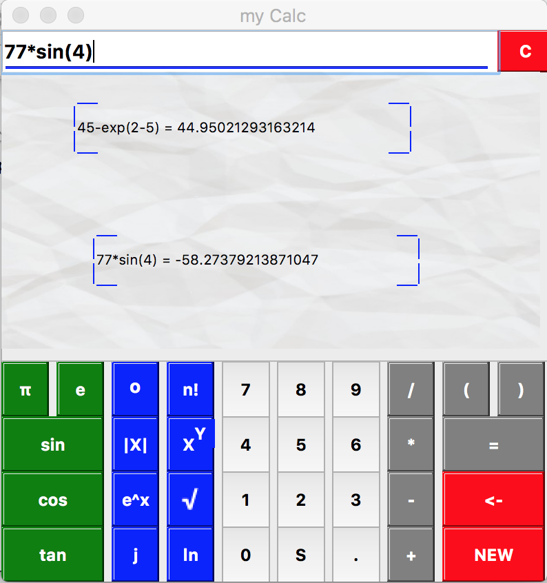

# Matlab calculator

Scientific calculator



### Prerequisites

What things you need to install the software and how to install them

```
Python3 - www.python.org
PyQt5   - pip install pyqt5
```
### Features

```
1. Instant answers based on current input.
2. Autocomplete braces.
3. Ability to move current workspace around.
4. Ability to create workspaces using the "NEW" button.
5. High precision calculation.
```


## Authors

* **Srikumar Sastry** - [Vishu26](https://github.com/Vishu26)

## License

This project is licensed under the MIT License - see the [LICENSE.md](LICENSE.md) file for details
